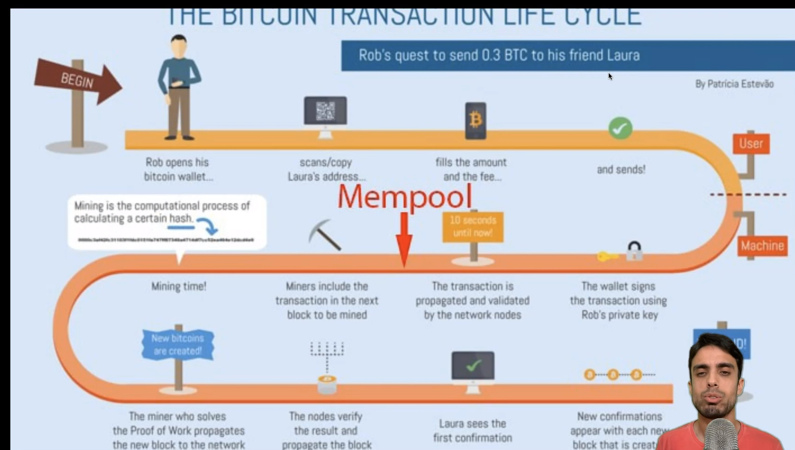
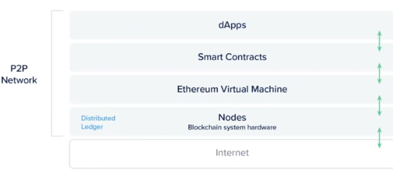

# Blockchain e Smart Contracts

- Blockchain: funciona como um livro razão distribuído

## Infos
- Repo do curso: https://github.com/luiztools-cursos/web23-alunos

## Bitcoin

- Paper: https://bitcoin.org/files/bitcoin-paper/bitcoin_pt_br.pdf
- Blockchain emmulation: https://andersbrownworth.com/blockchain
- Wallet demo project: https://github.com/anders94/public-private-key-demo.git
- Pool de mineração
    - Nicehash
    - Hiveon

## Proof of

- Work: Busca geração de um hash - hash rate. Não escala bem por gastar muita energia.
- Steak: Participação, qunto mais tokens na rede mais você consegue validar. Menos energia. Pool de steak. Tentou fraudar a rede cata suas moedos;
- Proof of useful work: Mineração que valida uma prova útil (cálculos científicos por exemplo)

## Protótipos

- Blockchain prototype: [protochain](./01-blockchain/01-protochain/READNE.md)

## Mempool

## Wallet

- Cliente da blockchain principalmente transações
- Envia os dados para blockchain
- Verificação de saldo

## Etherium

- DeFi: Finanças descentralizadas, utiliza smart contracts.
- Mantenedores: Fundação etherium
- Focada em GPU - quando proof of work
- Total supply - Não tem supply máximo, não é inflacionário quanto BTC.
- Proof of Stake - Possuir 32 ETH pode ser um validador.
- Bloco ETH - contém informações que permite rastrear todo o estado da rede.
- Aplicações:

    - Financeiras, problemas computacionais, votação, governança descentralizada, armazenamento decentralizado.
- Token - moeda digital não nativa da rede.
- NFT - bens únicos.

### Transações

- Contas: EOA (Padrão) e smart contracts.
- Code: Código do SC
- Storage: Demais dados do contrato

### GAS

- Unidade de medida: computação necessária para executar uma transação
-

## Smart Contract

- Usam EVM
- EVM mais famosa GEHT
- Tipos de transação
    - to: endereço do contrato
    - chamada: call - leitura de info sem custo | send - mudar o estado de uma conta
- Transações bem parecidas com a normal, sem value, com data
- Layers EVM: 

## Redes alternativas

- Cardano - Concebido para ter fins lucrativos, lançado como proof of stake

- Polygon - multi-chain layer 2.

- BNB Chain - Binance que nasce o token, proprietária e centralizada.

## links úteis

simulador de chaves ECDSA: https://kjur.github.io/jsrsasign/sample/sample-ecdsa.html
